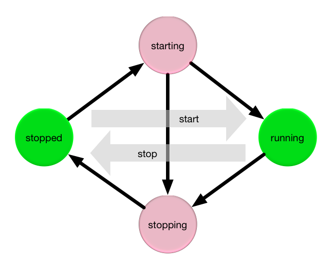

[](https://www.npmjs.com/package/statetransition-mixin)
[](https://opensource.org/licenses/BSD-3-Clause)
[](https://bundlephobia.com/result?p=statetransition-mixin)
[](https://npmjs.org/package/statetransition-mixin)
[](https://github.com/arlac77/statetransition-mixin/issues)
[](https://actions-badge.atrox.dev/arlac77/statetransition-mixin/goto)
[](https://github.com/prettier/prettier)
[](http://commitizen.github.io/cz-cli/)
[](https://snyk.io/test/github/arlac77/statetransition-mixin)
[](https://coveralls.io/github/arlac77/statetransition-mixin)

# statetransition-mixin

mixin to declare state transition methods like start & stop



# usage

<!-- skip-example -->

```js
import { StateTransitionMixin, prepareActions } = from 'statetransition-mixin';

const actions = prepareActions({
start: { // declare start() and call _start() internally
  stopped: { // can be called within stopped state
    target: "running",
    during: "starting",
    timeout: 10
  }
},
stop: { // declare stop() and call _stop() internally
  running: {. // can be called when running
    target: "stopped",
    during: "stopping",
    timeout: 5
  },
  starting: { // or when starting
    target: "stopped",
    during: "stopping",
    timeout: 10
  }
}
});

class BaseClass {}

class StatefullClass extends StateTransitionMixin(BaseClass, actions, 'stopped') {

  // will be called to go from stopped to running
  async _start() {
    return new Promise(resolve => setTimeout(() => resolve(), 10));
  }
}

let myObject = new StatefullClass();

console.log(myObject.state === 'stopped' ? "is stopped" : "hmm ?")

myObject.start().then( (o) => console.log('started == ${o.state}'));
console.log('starting == ${myObject.state}');

myObject.stop().then( (o) => console.log('stopped == ${o.state}'));
console.log('stopping == ${myObject.state}');
```

# API

<!-- Generated by documentation.js. Update this documentation by updating the source code. -->

### Table of Contents

*   [STATE](#state)
*   [TRANSITION](#transition)
*   [TRANSITION_PROMISE](#transition_promise)
*   [Action](#action)
    *   [Properties](#properties)
*   [Transition](#transition-1)
    *   [Properties](#properties-1)
*   [prepareActions](#prepareactions)
    *   [Parameters](#parameters)
    *   [Examples](#examples)
*   [StateTransitionMixin](#statetransitionmixin)
    *   [Parameters](#parameters-1)
*   [clazz](#clazz)
*   [rejectUnlessResolvedWithin](#rejectunlessresolvedwithin)
    *   [Parameters](#parameters-2)
*   [defineActionMethods](#defineactionmethods)
    *   [Special handling of consequent transitions](#special-handling-of-consequent-transitions)
    *   [Parameters](#parameters-3)

## STATE

current state

## TRANSITION

ongoing transition

## TRANSITION_PROMISE

promise of the ongoing transition

## Action

Type: [Object](https://developer.mozilla.org/docs/Web/JavaScript/Reference/Global_Objects/Object)

### Properties

*   `name` **[string](https://developer.mozilla.org/docs/Web/JavaScript/Reference/Global_Objects/String)** like 'start' or 'stop'
*   `transitions` **[Object](https://developer.mozilla.org/docs/Web/JavaScript/Reference/Global_Objects/Object)** possible transitions from the current state

## Transition

Type: [Object](https://developer.mozilla.org/docs/Web/JavaScript/Reference/Global_Objects/Object)

### Properties

*   `timeout` **[number](https://developer.mozilla.org/docs/Web/JavaScript/Reference/Global_Objects/Number)** in milliseconds the transtion is allowed to take
*   `initial` **[Transition](#transition)** 
*   `during` **[Transition](#transition)** 
*   `target` **[Transition](#transition)** 
*   `rejected` **[Transition](#transition)** 

## prepareActions

<!-- skip-example -->

Compile actions and states

### Parameters

*   `as` **[Object](https://developer.mozilla.org/docs/Web/JavaScript/Reference/Global_Objects/Object)** 

### Examples

```javascript
prepareActions({
'start':{
 'stopped': {
   'target': 'running',
   'during': 'starting'
}},
'stop': {
 'running': {
   'target': 'stopped',
   'during': 'stopping'
 }}});
```

Returns **[Array](https://developer.mozilla.org/docs/Web/JavaScript/Reference/Global_Objects/Array)** 

## StateTransitionMixin

Extends a class to support state transtions

### Parameters

*   `superclass` **Class** 
*   `actions` **[Array](https://developer.mozilla.org/docs/Web/JavaScript/Reference/Global_Objects/Array)<[Action](#action)>** 
*   `initialState` **[string](https://developer.mozilla.org/docs/Web/JavaScript/Reference/Global_Objects/String)** starting state

## clazz

Generated mixin class with support of state transtions

## rejectUnlessResolvedWithin

Rejects promise when it is not resolved within given timeout.

### Parameters

*   `promise` **[Promise](https://developer.mozilla.org/docs/Web/JavaScript/Reference/Global_Objects/Promise)** 
*   `timeout` **[number](https://developer.mozilla.org/docs/Web/JavaScript/Reference/Global_Objects/Number)** in miliseconds
*   `name` **[string](https://developer.mozilla.org/docs/Web/JavaScript/Reference/Global_Objects/String)** 

Returns **[Promise](https://developer.mozilla.org/docs/Web/JavaScript/Reference/Global_Objects/Promise)** 

## defineActionMethods

Defines methods to perform the state transitions.
States are traversed in the following way:

*current* -> *during* -> *final*

If the step is not in one of the transitions current
states and also not already in the transitions final
state a rejecting promise will be delivered from the
generated function. In the 'during' state a function
named '\_' + <transitions name> (sample: '\_start()')
will be called first.

It is expected that this function delivers a promise.

### Special handling of consequent transitions

While in a during state the former delivered promise will be
delivered again. This enshures that several consequent
transitions in a row will be fullfiled by the same promise.
There can only be one transition in place at a given point in time.

### Parameters

*   `object` **[Object](https://developer.mozilla.org/docs/Web/JavaScript/Reference/Global_Objects/Object)** target object where we define the methods
*   `actionsAndStates` **[Object](https://developer.mozilla.org/docs/Web/JavaScript/Reference/Global_Objects/Object)** object describing the state transitions

    *   `actionsAndStates.0`  
    *   `actionsAndStates.1`  

Returns **void** 

# install

With [npm](http://npmjs.org) do:

    npm install statetransition-mixin

# license

BSD-2-Clause
